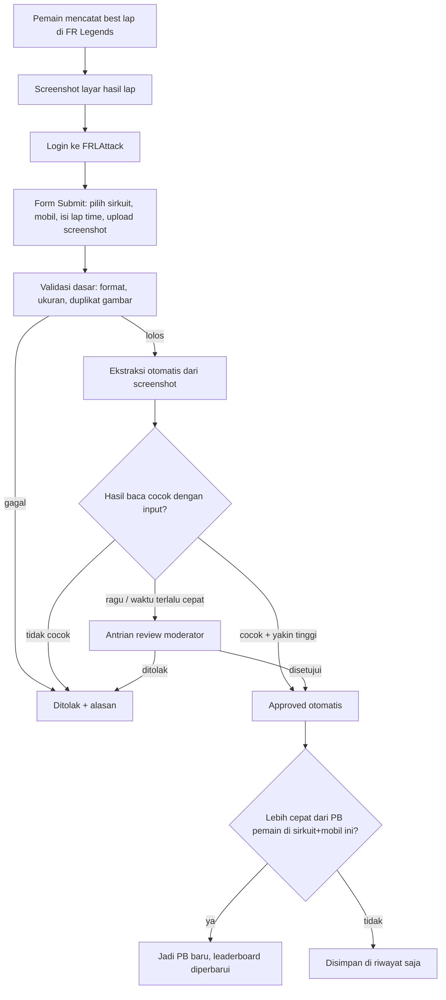

# FRLAttack — Rencana Proyek

> Database lap time komunitas untuk game **FR Legends**. Pemain mengirim screenshot best lap, sistem membaca dan memverifikasi waktunya, lalu waktu yang lolos masuk ke leaderboard tiap sirkuit.

---

## 1. Tujuan

| # | Tujuan | Ukuran berhasil |
|---|--------|-----------------|
| 1 | Jadi rujukan lap time FR Legends per sirkuit | Tiap sirkuit terdaftar punya leaderboard publik |
| 2 | Data bisa dipercaya | Setiap lap time punya bukti screenshot yang sudah diverifikasi |
| 3 | Kirim waktu itu cepat | Dari upload sampai tampil di leaderboard < 1 menit (jalur otomatis) |
| 4 | Pemain bisa memperbaiki waktunya | Personal best bisa diperbarui, riwayat tetap tersimpan |

**Di luar cakupan versi pertama:** turnamen/event berjadwal, aplikasi mobile native, integrasi langsung ke data game (tidak ada API resmi).

---

## 2. Alur Utama



### 2.1 Update lap time
- Pemain cukup **submit ulang** di sirkuit yang sama. Tidak ada tombol "edit angka" — setiap perubahan harus lewat screenshot baru supaya tetap terverifikasi.
- Leaderboard memakai **waktu tercepat yang approved** per pemain per (sirkuit, kategori).
- Submission lama tidak dihapus; masuk ke **riwayat progres** pemain (bisa dibuat grafik progres nanti).
- Pemain bisa menarik (withdraw) submission miliknya sendiri; leaderboard otomatis kembali ke PB sebelumnya.

---

## 3. Verifikasi Screenshot (inti sistem)

Verifikasi dibagi berlapis. Tidak ada satu cara pun yang anti-curang 100%, jadi tujuannya: **otomatis untuk kasus normal, manusia untuk kasus mencurigakan.**

### Lapis 1 — Validasi file (instan)
- Tipe: PNG/JPG/WEBP, maksimal ±8 MB, resolusi minimal (mis. 720p) supaya teks terbaca.
- **Hash gambar** (SHA-256 untuk duplikat persis + perceptual hash/pHash untuk duplikat yang di-resize/crop ringan). Screenshot yang sudah pernah dipakai → tolak.
- Simpan file asli di storage privat sebagai bukti; tampilkan versi terkompresi di publik.

### Lapis 2 — Ekstraksi data dari gambar
Membaca dari screenshot:
- Lap time (mis. `1:12.345`)
- Nama sirkuit (jika tertera di layar)
- Nama mobil / nama pemain (jika tertera)

Pilihan teknologi:

| Opsi | Kelebihan | Kekurangan |
|------|-----------|------------|
| **Model vision (Claude Haiku 4.5 / Sonnet 5.5) dengan output terstruktur (JSON)** — *rekomendasi* | Paham konteks layar game, tahan font bergaya, bisa sekalian menilai "apakah ini benar layar hasil FR Legends" | Ada biaya per gambar, perlu API key |
| OCR klasik (Tesseract) | Gratis, bisa jalan sendiri | Lemah di font game & latar ramai, perlu cropping per-layout |
| Google Cloud Vision OCR | Akurat untuk teks | Hanya teks mentah, logika pencocokan harus dibuat sendiri |

Rekomendasi: **model vision sebagai jalur utama**, dengan prompt yang meminta JSON:
```json
{
  "is_fr_legends_result_screen": true,
  "lap_time": "1:12.345",
  "track_name": "…",
  "car_name": "…",
  "player_name": "…",
  "confidence": 0.0,
  "notes": "tanda-tanda edit, teks terpotong, dll."
}
```

### Lapis 3 — Pencocokan & keputusan
| Kondisi | Keputusan |
|---------|-----------|
| Lap time terbaca **sama persis** (dalam milidetik) dengan input, sirkuit cocok, confidence tinggi | **Auto-approve** |
| Terbaca tapi confidence rendah / sebagian teks tidak terbaca | **Review moderator** |
| Waktu lebih cepat dari rekor sirkuit, atau jauh di atas sebaran normal (outlier) | **Review moderator** (walau cocok) |
| Akun baru (mis. < 3 submission approved) | **Review moderator** untuk beberapa submission pertama |
| Lap time terbaca berbeda dari input, atau bukan layar FR Legends | **Tolak** + alasan |

### Lapis 4 — Pengawasan komunitas
- Tombol **Laporkan** di setiap entri leaderboard (alasan: edit/foto palsu, akun ganda, dll.).
- Entri yang dilaporkan beberapa kali → kembali ke antrian review.
- Opsional untuk **Top 3 / rekor sirkuit**: minta bukti video (link YouTube/TikTok) tambahan.

### Batasan yang perlu diterima
- Screenshot bisa diedit secara rapi; AI/OCR tidak bisa menjamin keaslian. Karena itu ada review manual, laporan komunitas, dan video untuk rekor.
- **Perlu sampel screenshot asli** layar hasil lap FR Legends (berbagai sirkuit, HP, resolusi, bahasa) untuk menyetel prompt/OCR sebelum fitur ini dirilis.

---

## 4. Fitur per Halaman

| Halaman | Isi |
|---------|-----|
| **Beranda** | Rekor terbaru, submission terbaru, sirkuit populer, tombol "Submit Lap" |
| **Daftar Sirkuit** | Kartu sirkuit (gambar, layout, jumlah entri, pemegang rekor) |
| **Leaderboard Sirkuit** | Tabel peringkat; filter kategori/mobil/platform/versi game; klik baris → lihat screenshot bukti |
| **Submit Lap** | Pilih sirkuit → kategori/mobil → isi lap time → upload screenshot → status verifikasi langsung |
| **Profil Pemain** | Nama in-game, negara, semua PB per sirkuit, riwayat & grafik progres |
| **Submission Saya** | Status (pending/approved/rejected) + alasan penolakan, withdraw |
| **Panel Moderator** | Antrian review (screenshot berdampingan dengan hasil baca AI), approve/reject, kelola laporan |
| **Panel Admin** | Kelola sirkuit, layout, mobil, kategori, peran user |
| **Aturan** | Syarat screenshot yang valid, aturan kategori, kebijakan kecurangan |

---

## 5. Model Data (garis besar)

Lap time disimpan sebagai **integer milidetik** (`72345` = `1:12.345`) agar mudah diurutkan dan dibandingkan.

```
profiles            id, username, ingame_name, country, avatar_url, role(user|mod|admin), created_at
tracks              id, slug, name, image_url, is_active
track_layouts       id, track_id, name (mis. arah normal/terbalik/layout lain), is_active
cars                id, name, is_active
categories          id, name, description           -- mis. "Bebas", "Stock", per-kelas mobil
submissions         id, user_id, layout_id, car_id, category_id,
                    claimed_time_ms, platform, game_version,
                    screenshot_path, image_sha256, image_phash,
                    status(pending|approved|rejected|withdrawn),
                    reject_reason, video_url, created_at, reviewed_by, reviewed_at
verifications       id, submission_id, engine, raw_output(jsonb),
                    extracted_time_ms, extracted_track, confidence, decision, created_at
personal_bests      (view/materialized) best approved time per user × layout × category
reports             id, submission_id, reporter_id, reason, status, created_at
audit_log           id, actor_id, action, target, payload(jsonb), created_at
```

Aturan penting:
- Unik `image_sha256` di `submissions` (cegah screenshot dipakai ulang).
- Leaderboard = query dari `personal_bests`, urut `time_ms ASC`, lalu `created_at ASC` (yang lebih dulu mencatat waktu sama menang).

---

## 6. Teknologi yang Diusulkan

| Lapisan | Pilihan | Alasan |
|---------|---------|--------|
| Frontend + backend | **Next.js (App Router) + TypeScript** | Satu codebase, SSR bagus untuk SEO halaman leaderboard |
| UI | Tailwind CSS + shadcn/ui | Cepat, konsisten, mobile-friendly (mayoritas pemain FR Legends main di HP) |
| Database & Auth | **Supabase** (Postgres + Auth + Row Level Security) | Login Google/Discord, aturan akses di level database |
| Penyimpanan gambar | Supabase Storage (bucket privat + versi publik terkompresi) | Satu tempat dengan DB |
| Verifikasi | Server route / background job yang memanggil model vision | API key tidak pernah ke browser |
| Hosting | **Vercel** | Deploy otomatis dari GitHub |
| Anti-spam | Rate limit per user (mis. 10 submit/jam) + captcha (Cloudflare Turnstile) | Cegah banjir upload & biaya verifikasi |

Login yang disarankan: **Discord** (komunitas FR Legends banyak di Discord) + Google.

---

## 7. Tahapan Pengerjaan

### Fase 0 — Riset & persiapan
- [ ] Kumpulkan 30–50 screenshot layar hasil lap asli (berbagai sirkuit, HP, resolusi)
- [ ] Susun daftar resmi sirkuit + layout + mobil yang akan didaftarkan
- [ ] Tentukan kategori leaderboard (lihat Pertanyaan Terbuka)
- [ ] Tulis halaman aturan submission

### Fase 1 — MVP (submit + review manual)
- [ ] Setup Next.js + Supabase + Vercel
- [ ] Auth (Discord/Google) + profil
- [ ] CRUD admin: sirkuit, layout, mobil, kategori
- [ ] Form submit + upload + validasi file + cek duplikat hash
- [ ] Panel moderator: approve/reject manual
- [ ] Leaderboard per sirkuit + halaman profil
- [ ] Update PB via submit ulang + riwayat

> Di fase ini semua submission direview manual. Situs sudah bisa dipakai dan sekaligus mengumpulkan data untuk melatih/menguji verifikasi otomatis.

### Fase 2 — Verifikasi otomatis
- [ ] Integrasi model vision + output JSON terstruktur
- [ ] Logika pencocokan & keputusan (auto-approve / review / tolak)
- [ ] Uji akurasi pada kumpulan screenshot Fase 0–1 (target: ≥ 95% lap time terbaca tepat)
- [ ] Deteksi outlier & aturan akun baru
- [ ] Tampilkan status verifikasi real-time ke pemain

### Fase 3 — Komunitas & kepercayaan
- [ ] Fitur lapor + alur penanganan laporan
- [ ] Bukti video untuk rekor/Top 3
- [ ] Badge (pemegang rekor, terverifikasi), notifikasi saat rekor dipecahkan
- [ ] Grafik progres pemain

### Fase 4 — Polesan
- [ ] SEO & gambar share (Open Graph) untuk tiap leaderboard
- [ ] Dukungan bahasa Indonesia & Inggris
- [ ] Statistik global (sirkuit terpopuler, mobil terbanyak dipakai)
- [ ] API publik read-only (opsional)

---

## 8. Risiko & Mitigasi

| Risiko | Mitigasi |
|--------|----------|
| Screenshot hasil edit | Review manual untuk outlier/rekor, laporan komunitas, video untuk rekor, simpan file asli sebagai bukti |
| Screenshot milik orang lain | Cek hash duplikat, cocokkan nama pemain di layar dengan `ingame_name` profil (jika tampil di layar) |
| Layout layar berbeda antar versi game/HP | Kumpulkan sampel luas, model vision lebih tahan dibanding OCR berbasis koordinat |
| Biaya API verifikasi membengkak | Rate limit, kompres gambar sebelum dikirim ke model, pakai model kecil dulu dan model besar hanya jika ragu |
| Moderator kewalahan | Ambang auto-approve disetel bertahap dari data nyata; rekrut moderator dari komunitas |
| Perbedaan tuning mobil membuat perbandingan tidak adil | Kategori leaderboard (lihat di bawah) |

---

## 9. Pertanyaan Terbuka (perlu keputusan)

1. **Apa saja yang tampil di layar hasil lap FR Legends?** Apakah ada nama sirkuit, mobil, dan nama pemain? Ini menentukan seberapa kuat verifikasi otomatis.
2. **Kategori leaderboard:** cukup satu leaderboard per sirkuit, atau dipisah per mobil / kelas tuning / platform (Android vs iOS) / kontrol (tilt vs tombol)?
3. **Sirkuit awal** mana saja yang didaftarkan, dan apakah layout terbalik/variasi dihitung terpisah?
4. **Versi game:** apakah waktu dari versi lama tetap berlaku jika ada update yang mengubah fisika/sirkuit?
5. **Login:** Discord, Google, atau keduanya?
6. **Bahasa situs:** Indonesia saja, atau Indonesia + Inggris sejak awal?
7. **Anggaran:** boleh ada biaya bulanan kecil untuk API verifikasi dan hosting, atau harus gratis sepenuhnya (berarti OCR self-host)?
